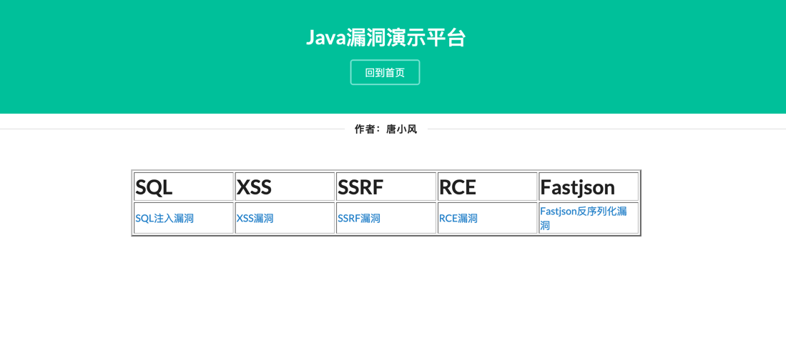
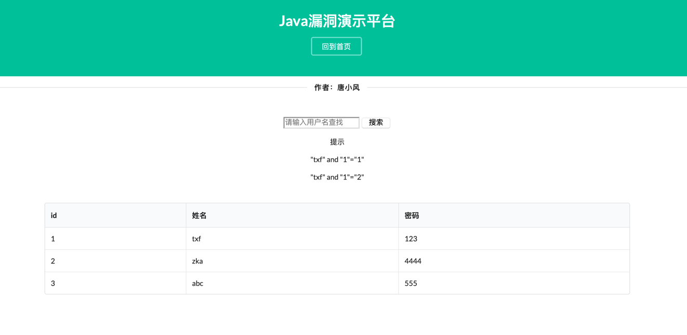
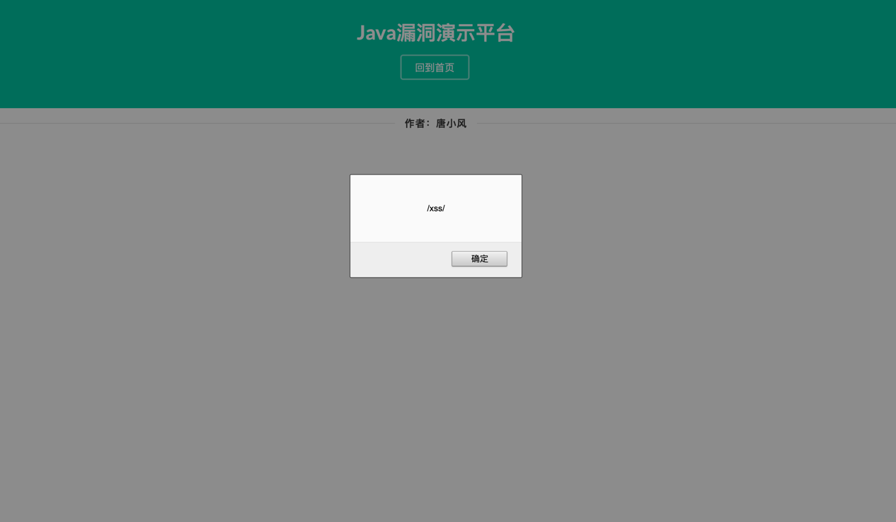
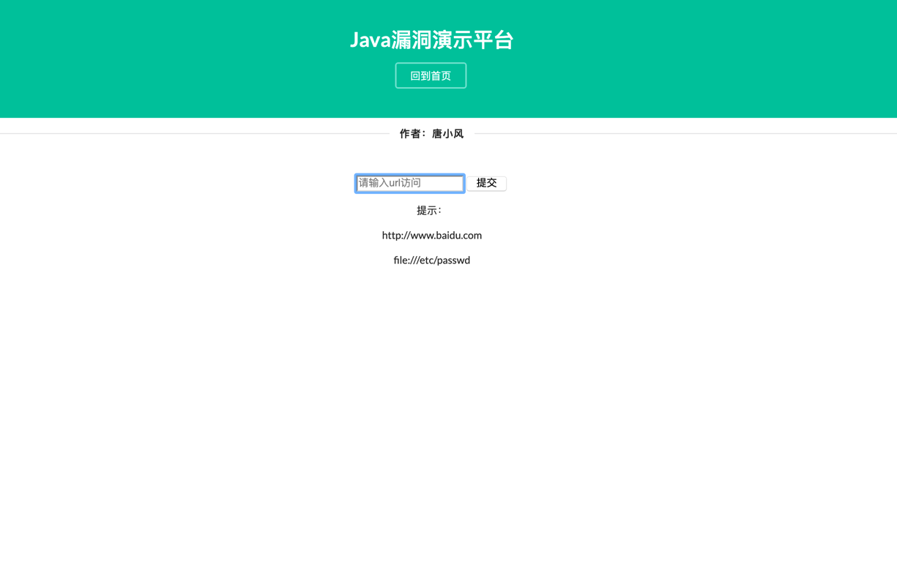
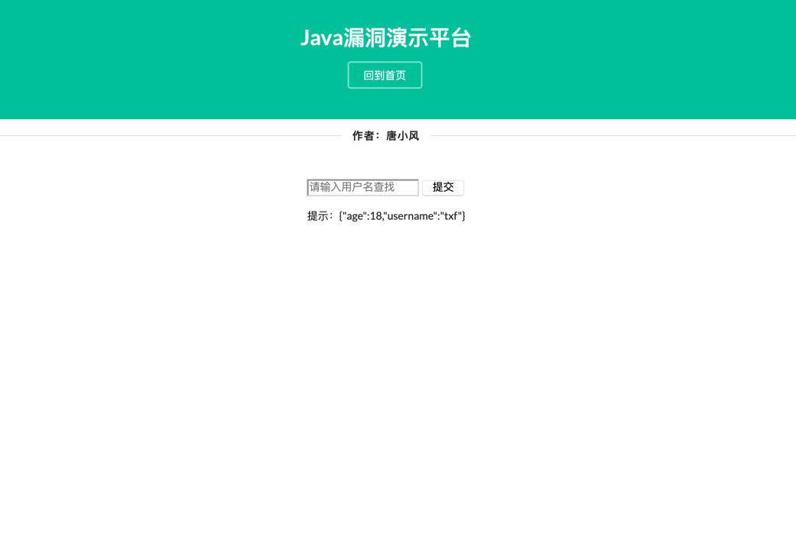

# SecExample

包含：

* SQL 注入漏洞
* XSS 漏洞
* SSRF 漏洞
* RCE 漏洞
* Fastjson反序列化漏洞

### 使用说明
```git
git clone https://github.com/tangxiaofeng7/SecExample.git
cd SecExample
docker-compose up -d
```

然后访问：http://localhost:8080

### 安装docker-compose

- 安装 docker-compose [官方文档](https://docs.docker.com/compose/install/)
    - ```shell script
       # 在Linux安装
       # 1.1 运行此命令以下载Docker Compose的当前稳定版本
       sudo curl -L "https://github.com/docker/compose/releases/download/1.26.2/docker-compose-$(uname -s)-$(uname -m)" -o /usr/local/bin/docker-compose
       # 1.2 将可执行权限应用于二进制文件
       sudo chmod +x /usr/local/bin/docker-compose 
      ```
    - ```shell script
       # 使用Python的pip安装 
       pip3 install docker-compose -i https://pypi.tuna.tsinghua.edu.cn/simple
      ```
    - 使用 Docker Desktop
        - Windows: https://hub.docker.com/editions/community/docker-ce-desktop-windows
        - Mac: https://hub.docker.com/editions/community/docker-ce-desktop-mac/
    
### 靶场展示

#### 首页

#### SQL 注入漏洞

#### XSS 漏洞

#### SSRF 漏洞

#### RCE 漏洞

#### Fastjson反序列化漏洞
