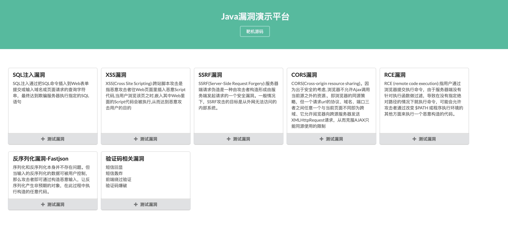

<div align="center">


JAVA 漏洞靶场
<br>
https://github.com/tangxiaofeng7/SecExample
<br>
</div>

### 截图




### 介绍
| Name               | Star |
| ---------------------- | ---- |
| [注入漏洞-SQL注入]         | 🌟🌟🌟  |
| [注入漏洞-命令注入]             | 🌟    |
| [注入漏洞-spel表达式注入]             | 🌟🌟🌟    |
| [XSS漏洞]            | 🌟  |
| [CSRF漏洞]             | 🌟🌟    |
| [SSRF漏洞]             | 🌟🌟  |
| [CORS漏洞] | 🌟🌟🌟🌟 |
| [反序列化漏洞-Fastjson反序列化] | 🌟🌟🌟🌟 |
| [验证码相关漏洞] | 🌟🌟 |


### 安装

```
git clone https://github.com/tangxiaofeng7/SecExample.git
cd SecExample
docker-compose up -d
```

访问: http://localhost:8080

[](https://asciinema.org/a/gcuay3zNoRUZ85BTPgjpGukuC)

